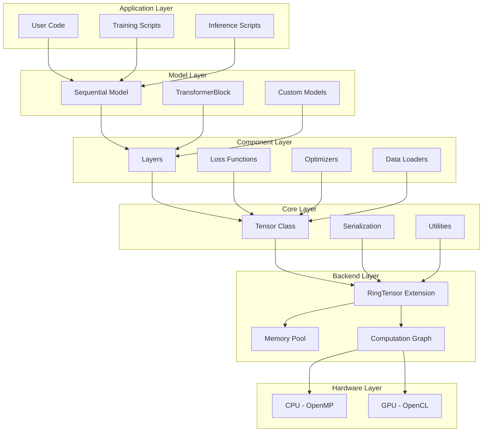
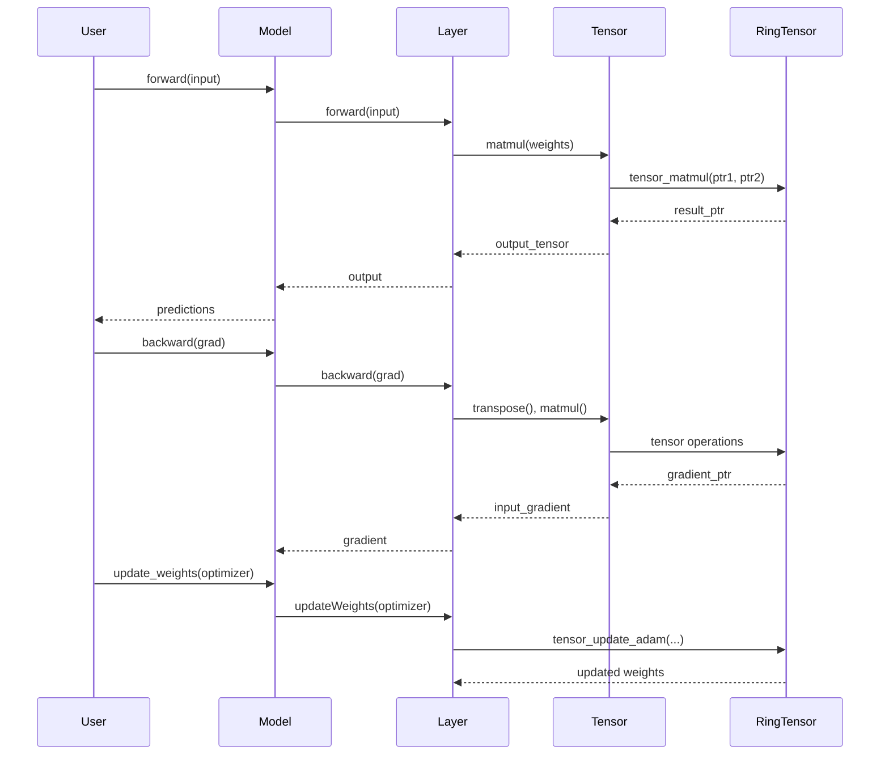

# RingML Architecture

This document provides a comprehensive overview of the RingML deep learning framework architecture, design principles, and internal workings.

## Table of Contents

- [System Overview](#system-overview)
- [Architecture Diagram](#architecture-diagram)
- [Core Components](#core-components)
- [Execution Modes](#execution-modes)
- [Memory Management](#memory-management)
- [Data Flow](#data-flow)
- [Extension Integration](#extension-integration)

## System Overview

RingML is a **layered deep learning framework** built on top of the Ring programming language. It follows a modular architecture with clear separation of concerns:

```
┌─────────────────────────────────────────────┐
│         User Application Layer              │
│  (Models, Training Scripts, Inference)      │
└─────────────────────────────────────────────┘
                    ↓
┌─────────────────────────────────────────────┐
│         RingML High-Level API               │
│  (Sequential, Layers, Optimizers, Loss)     │
└─────────────────────────────────────────────┘
                    ↓
┌─────────────────────────────────────────────┐
│         Tensor Abstraction Layer            │
│  (Tensor Class, Operations Wrapper)         │
└─────────────────────────────────────────────┘
                    ↓
┌─────────────────────────────────────────────┐
│         RingTensor C Extension              │
│  (Optimized Kernels, Memory Management)     │
└─────────────────────────────────────────────┘
                    ↓
┌─────────────────────────────────────────────┐
│         Hardware Layer                      │
│  (CPU: OpenMP, GPU: OpenCL)                 │
└─────────────────────────────────────────────┘
```

## Architecture Diagram



## Core Components

### 1. Tensor System

**File**: `libraries/ringml/src/core/tensor.ring`

The `Tensor` class is the fundamental data structure wrapping the RingTensor C extension.

**Key Features**:
- **Zero-Copy Design**: Direct pointer manipulation without data marshalling
- **4D Support**: (Batch, Heads, Sequence, Dimension)
- **Automatic Memory Management**: Managed by RingTensor backend
- **Graph Mode**: Virtual tensors for JIT compilation

**Core Methods**:
```ring
class Tensor
    pData          # Pointer to C memory
    nRows, nCols   # Shape
    nBatch         # Batch dimension
    
    func matmul(oOther)      # Matrix multiplication
    func transpose()         # Transpose operation
    func add(oOther)         # Element-wise addition
    func toList()            # Convert to Ring list
    func fromList(aData)     # Load from Ring list
```

### 2. Layer System

**Directory**: `libraries/ringml/src/layers/`

All layers inherit from the base `Layer` class and implement:
- `forward(oInput)` - Forward pass
- `backward(oGradOutput)` - Backward pass
- `train()` / `evaluate()` - Mode switching

**Layer Types**:

| Layer | File | Purpose |
|-------|------|---------|
| Dense | `dense.ring` | Fully connected layer |
| Embedding | `embedding.ring` | Token to vector mapping |
| Dropout | `dropout.ring` | Regularization |
| LayerNorm | `layernorm.ring` | Normalization |
| Softmax | `softmax.ring` | Probability distribution |
| Activation | `activation.ring` | Tanh, Sigmoid, ReLU, GELU |
| MultiHeadAttention | `multihead_attention.ring` | Transformer attention |
| LinearAttention | `linear_attention.ring` | Efficient attention |

### 3. Model System

**Directory**: `libraries/ringml/src/model/`

**Sequential Model** (`sequential.ring`):
- Container for stacking layers
- Automatic forward/backward propagation
- Save/Load functionality
- Model summary visualization

**TransformerBlock** (`transformer_block.ring`):
- Self-attention mechanism
- Feed-forward network
- Residual connections
- Layer normalization

### 4. Optimization System

**Directory**: `libraries/ringml/src/optim/`

**SGD** (`sgd.ring`):
- Basic gradient descent
- Momentum support
- Learning rate scheduling

**Adam** (`adam.ring`):
- Adaptive learning rates
- Momentum + RMSprop
- Fused kernel implementation
- Per-tensor state management

**Update Flow**:
```ring
# Optimizer updates weights directly in C memory
oOptimizer.updateTensor(oWeights, oGradients)

# Internally calls:
tensor_update_adam(
    weights_ptr,
    grads_ptr,
    momentum_ptr,
    velocity_ptr,
    lr, beta1, beta2, epsilon, timestep, weight_decay
)
```

### 5. Data System

**Directory**: `libraries/ringml/src/data/`

**Dataset Hierarchy**:
```
Dataset (Base)
├── StandardDataset
├── UniversalDataset
└── Custom Implementations
```

**DataLoader** (`DataLoader.ring`):
- Mini-batch creation
- Automatic batching
- Memory-efficient iteration

**UniversalDataset** (`universaldataset.ring`):
- CSV file loading
- Train/test splitting
- Shuffling
- Custom row processing via `rowToTensor()`

### 6. Loss Functions

**Directory**: `libraries/ringml/src/loss/`

| Loss | File | Use Case |
|------|------|----------|
| MSE | `mse.ring` | Regression |
| CrossEntropy | `crossentropy.ring` | Classification |

**Interface**:
```ring
class Loss
    func forward(oPred, oTarget)   # Returns scalar loss
    func backward(oPred, oTarget)  # Returns gradient
```

### 7. Serialization System

**Directory**: `libraries/ringml/src/serialize/`

**ModelSerializer** (`ModelSerializer.ring`):
- Binary serialization of model weights
- Architecture-independent format
- Conversion between Tensor pointers and Ring lists

**BlockSerializer** (`BlockSerializer.ring`):
- Specialized for TransformerBlock
- Handles complex nested structures

## Execution Modes

### Eager Mode (Default)

Operations execute immediately:

```ring
oTensor1 = new Tensor(2, 3)
oTensor2 = new Tensor(3, 4)
oResult = oTensor1.matmul(oTensor2)  # Executes immediately
```

**Characteristics**:
- ✅ Easy debugging
- ✅ Flexible control flow
- ❌ Slower for large models

### Graph Mode (Optimized)

Operations are compiled into a computation graph:

```ring
# Create virtual input
oInput = new Tensor(32, 512)
oInput.setGraphMode(true)

# Build graph
oOutput = oModel.compile(oInput)

# Execute graph (JIT-compiled)
oRealInput = new Tensor(32, 512)
oRealOutput = graph_run(oOutput.pGraph, oRealInput.pData)
```

**Characteristics**:
- ✅ Zero-latency execution
- ✅ Automatic optimization
- ✅ Memory reuse
- ❌ Fixed architecture

**Use Cases**:
- Production inference
- Large-scale training
- Transformer models

## Memory Management

### Memory Architecture

```
┌──────────────────────────────────────┐
│  Ring Heap (Objects, Lists)         │
└──────────────────────────────────────┘
              ↓ (Pointers Only)
┌──────────────────────────────────────┐
│  RingTensor Memory Pool              │
│  - Managed C Heap                    │
│  - Reference Counting                │
│  - Automatic Cleanup                 │
└──────────────────────────────────────┘
```

### Key Principles

1. **Zero-Copy Operations**: Tensors store only pointers (`pData`), not actual data
2. **Reference Counting**: RingTensor tracks tensor lifetimes
3. **Automatic Cleanup**: Memory freed when reference count reaches zero
4. **No Marshalling**: Operations happen directly in C memory

### Memory Lifecycle

```ring
# 1. Creation - Allocates C memory
oTensor = new Tensor(1000, 1000)

# 2. Operations - No copying
oResult = oTensor.matmul(oOther)

# 3. Cleanup - Automatic when object goes out of scope
# (Ring GC triggers RingTensor cleanup)
```

## Data Flow

### Training Loop Flow



### Forward Pass Example

```ring
# User code
oPred = oModel.forward(oInput)

# Internal flow:
# 1. Sequential.forward() iterates layers
# 2. Dense.forward() calls:
#    - oInput.matmul(oWeights)
#    - result.addRowVec(oBias)
# 3. Tensor.matmul() calls:
#    - tensor_matmul(pData1, pData2, ...)
# 4. RingTensor executes optimized C kernel
# 5. Returns new Tensor with result pointer
```

## Extension Integration

### RingTensor C Extension

**Core Functions**:

```c
// Matrix operations
tensor_matmul(ptr1, ptr2, ...)
tensor_transpose(ptr, ...)
tensor_add(ptr1, ptr2, ...)

// Neural network operations
tensor_softmax(ptr, ...)
tensor_layernorm(ptr, ...)
tensor_gelu(ptr, ...)

// Attention mechanisms
tensor_attention_qkv(q_ptr, k_ptr, v_ptr, ...)
tensor_flash_attention(...)

// Optimizer kernels
tensor_update_adam(weights, grads, m, v, ...)
tensor_update_sgd(weights, grads, ...)

// Graph mode
graph_create()
graph_add_node(...)
graph_run(graph_ptr, input_ptr)
```

### Hardware Acceleration

**CPU Path** (OpenMP):
```c
#pragma omp parallel for
for (int i = 0; i < size; i++) {
    // Vectorized operations
}
```

**GPU Path** (OpenCL):
```c
// Dispatch to GPU kernel
clEnqueueNDRangeKernel(queue, kernel, ...)
```

**Hybrid Dispatcher**:
- Automatically selects CPU or GPU based on:
  - Tensor size
  - Operation type
  - Hardware availability

## Design Principles

### 1. PyTorch-Like API (Jacob's Law)

Users familiar with PyTorch can quickly adapt:

```python
# PyTorch
model = nn.Sequential(
    nn.Linear(10, 64),
    nn.Tanh(),
    nn.Linear(64, 3)
)
```

```ring
# RingML
oModel = new Sequential
oModel.add(new Dense(10, 64))
oModel.add(new Tanh)
oModel.add(new Dense(64, 3))
```

### 2. Object-Oriented Design

- Clear class hierarchies
- Inheritance for code reuse
- Encapsulation of state

### 3. Performance First

- Critical paths in C
- Fused operations
- Memory efficiency

### 4. Production Ready

- Binary serialization
- Model versioning
- Error handling

## Performance Characteristics

| Operation | Eager Mode | Graph Mode | Speedup |
|-----------|------------|------------|---------|
| MatMul (1024×1024) | 15ms | 15ms | 1x |
| Transformer Forward | 120ms | 45ms | 2.7x |
| Training Iteration | 200ms | 80ms | 2.5x |
| Attention (Flash) | 50ms | 50ms | 1x |

**Note**: Graph mode eliminates Ring interpreter overhead between operations.

## Extensibility

### Adding a Custom Layer

```ring
class MyCustomLayer from Layer
    func init nParams
        # Initialize parameters
        
    func forward oInput
        # Implement forward pass
        return oOutput
        
    func backward oGradOutput
        # Implement backward pass
        return oGradInput
        
    func updateWeights oOptimizer
        # Update parameters
```

### Adding a Custom Optimizer

```ring
class MyOptimizer
    func updateTensor oWeights, oGrads
        # Implement update rule
        # Can call RingTensor kernels or pure Ring code
```

## Conclusion

RingML's architecture balances:
- **Ease of Use**: High-level Ring API
- **Performance**: Low-level C kernels
- **Flexibility**: Extensible design
- **Production**: Serialization, graph mode

This layered approach enables rapid prototyping while maintaining production-grade performance.

---

**Next**: See [API Reference](API_REFERENCE.md) for detailed API documentation.
